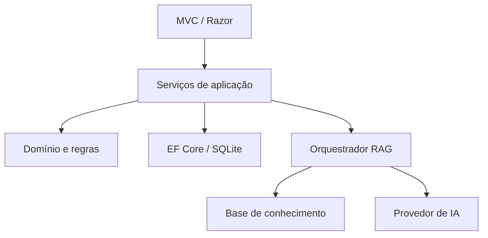

# ERP.AI

ERP educacional em ASP.NET Core MVC que combina fluxos administrativos com uma camada de IA baseada em RAG. O projeto demonstra engenharia de software, segurança, testes e IA aplicada para estudo e portfólio.

## Estado atual

- Dashboard e identidade visual preservados.
- CRUD de clientes com SQLite, Entity Framework Core e dados demonstrativos.
- Validação no navegador e servidor, antiforgery e prevenção de duplicidade.
- Interface que desacopla o RAG do provedor de LLM.
- Testes de domínio e pipeline de CI.
- Telas demonstrativas de pedidos e nota fiscal aguardando integração aos casos de uso.

## Arquitetura evolutiva



O SQLite facilita demonstrações locais. A persistência pode ser substituída por SQL Server ou PostgreSQL sem levar detalhes do banco aos controllers.

## Executar e testar

Requisito: SDK do .NET 9.

```bash
dotnet restore
dotnet run
dotnet test ERP.AI.sln
```

O banco `erp-ai.db` é criado na primeira execução e não é versionado.

## Segurança e IA

Chaves de LLM nunca devem ser gravadas no repositório ou no JavaScript. Use User Secrets no desenvolvimento e variáveis de ambiente ou um secret manager em produção. A implementação atual usa um provedor demonstrativo para funcionar sem credenciais.

## Roadmap

1. Clientes e regras comerciais.
2. Pedidos, descontos e aprovação gerencial.
3. Cotações.
4. Importação segura de XML e validação fiscal.
5. Contas a pagar e receber.
6. Autenticação, papéis e auditoria.
7. Ingestão de documentos, embeddings, recuperação e respostas com evidências.
8. Docker, observabilidade e publicação da demonstração.
